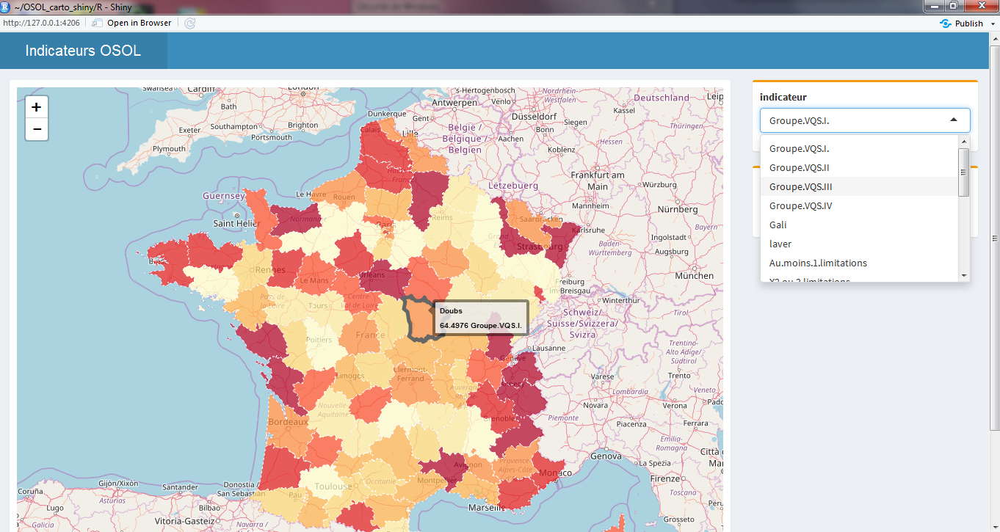

# Introduction
Le but de ce projet est de créer des visualisations interactives basées sur des cartes afin d'explorer et interpréter plus facilement les indicateurs statistiques produits par la DREES.
# Demo
Voici un aperçu de l'application

# A propos des polygones
Les polygones sont issus du site gadm.org et ne concernent pour l'instant que la France Métropolitaine. 
Dans un soucis d'optimisation des performances, les polygones ont été simplifiés à 1% et 10% grâce au package R <b>rmapshaper</b>. 
# Limites
Pour l'instant cette démonstration est faite sur un fichier de statistiques produites par la DREES, un travail de généralisation permettra de standardiser la jointure avec d'autres tableaux d'indicateurs.
